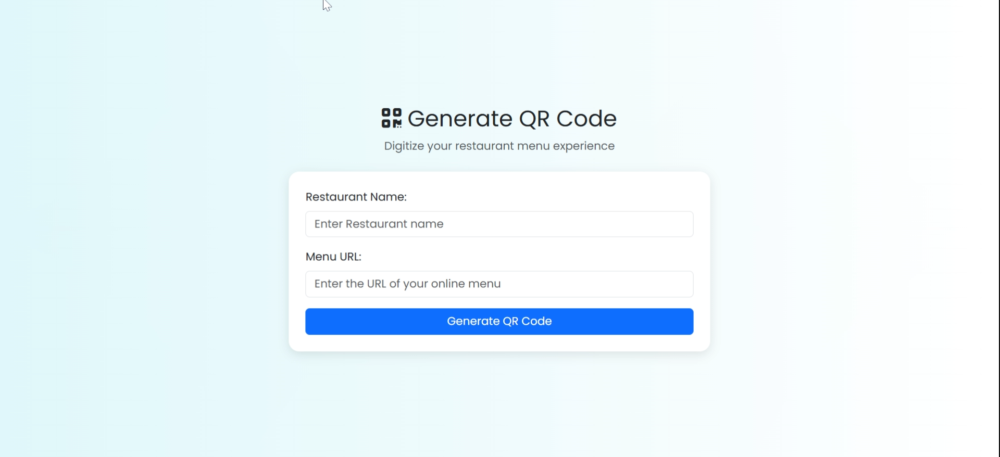
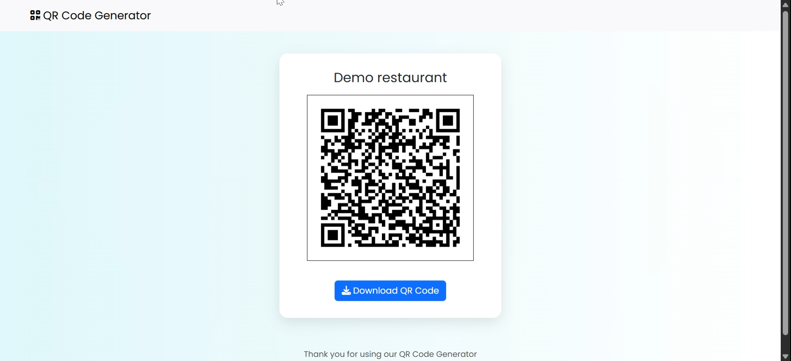

# QR Menu Card Generator 

This project allows restaurant administrators to digitally generate QR codes for their menu cards instead of using physical menus. The admin can input the restaurant name and Google Drive menu link, and the system will generate a downloadable QR code that can be printed and placed on tables for customers to scan.

This ensures improved user convenience, better hygiene, reduced printing costs, and a modernized dining experience.
---

## Features

- Admin adds:
  - Restaurant name
  - Menu link (Google Drive or any online file)
  
- Instantly generates a QR code

- Option to download and print the QR code
- Clean and responsive interface

---

## Tech Stack

- **Backend**: Python, Django
- **Frontend**: HTML, CSS, JavaScript
- **QR Code Generator**: `qrcode` Python library and pillow library
- **UI Styling**: Bootstrap

---

## Advantages

- Enhances user experience and convenience
- Hygienic and touchless menu access
- Saves printing costs
- Simple and effective admin interface
- Easily updateable (update the drive link anytime)

---

## Usage

1. Clone the repository
2. Create and activate a virtual environment
python -m venv env
env\Scripts\activate         # Windows
3. Install dependencies
pip install -r requirements.txt
4. Run Django server
python manage.py runserver

---

## Future Enhancements
- Admin authentication (login system)

- Store data in a database (restaurant + links)

- QR code analytics (how many scans)

- Generate multiple QR codes for multiple branches